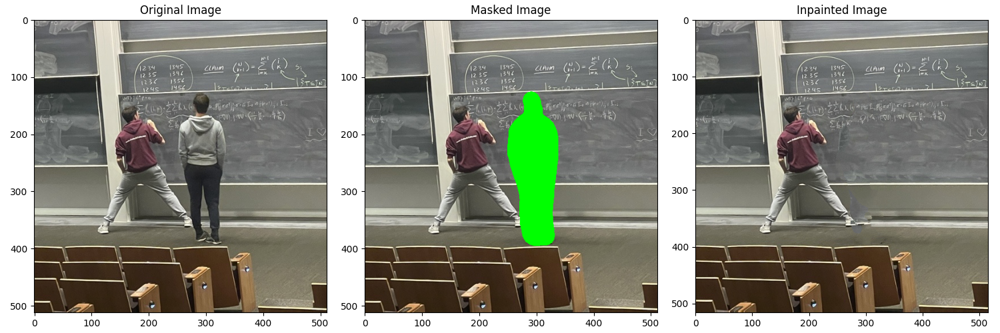

# Parallel Patch Match

## Title: Parallel NNFs with PatchMatch
Micah Reich (mreich), David Krajewski (dkrajews)

## Milestone Report

### Progress Update
So far, we have a completed sequential version of the full image inpainting algorithm written in Python. Completing this was crucial since it allows us to have a reference for writing our C++ version as well as giving us an initial benchmark timing-wise. We have also been actively working on our C++ sequential implementation, and are roughly 75% done with it. We currently have an interface working that allows users to import an image and draw a mask around it that they wish to inpaint. Our implementation thus far has been really focused on writing code that will easily plug into OpenMP. The only portions left for our sequential version are the ANN (Approximate Nearest Neighbor) algorithm and then combining everything else we wrote to have the completed workflow. We are confident we will have meaningful results to show at the poster session.

A good chunk of the time we have spent so far has been reading research papers that outline what we wish to implement. The initial paper we had found (PatchMatch) gave a general overview of the algorithm involved in searching for nearest neighbors but didn't go in-depth into the specifics of the implementation and did not have any information on content-aware fill. In our search, we found a paper that outlines exactly what we wish to accomplish for both images and videos, which is the current paper we are using as a reference for our implementation. We also came across another paper that replaces the Propagation step of the algorithm, which was initially not parallelizable, with a Jump Flood approach, allowing us to achieve high parallelization without sacrificing quality. 

Based on the progress we have made thus far, we believe that diving deeper into the CPU parallelism that is achievable will be more fruitful than writing a CUDA implementation. Thus, we are modifying our goal and will exclusively focus on having a robust paralalleized CPU implementation. We plan on analyzing the different scheduling policies and parallel configurations that OpenMP offer. Aside from that, we are confident we will have a fully working algorithm and a live demo at the poster session. Below find an example of the inpainting algorithm result, implemented by us in Python:

### Updated Schedule

Monday 12/4-Weds 12/6: Sequential + OpenMP
- Micah: finish C++ implementation (sequential) of ANN search function with Jump Flood propagation, finish C++ implementation (sequential) of initialization and piece together each step into final algorithm
- David: convert existing CImg UI to OpenCV UI, incrementally test C++ sequential version agaisnt Python (inspect image pyramids, blurring, dilation, erosion, etc) and benchmark sequential timing; start OpenMP conversion, mostly using parallel for pragmas to start

Thurs 12/7-Monday 12/11: OpenMP + Benchmarking
- Micah: Help David with debugging OpenMP if needed; begin work on expirementation with different OpenMP functions and scheduling policies 
- David: Finish initial OpenMP implementation and benchmark all CPU parallel results and make figures. Start writing the final report (summary, background, approach) 

Tuesday 12/12-Friday 12/15: Presentation Materials
- Micah: Write results section of final report; Help David with finishing the poster and get it printed
- David: Finish creating figures; help Micah finish the report paper; Create separate figures and explanations for the poster

### Updated Goals
As mentioned previously, we will be presenting an interface and OpenMP CPU-parallel version of PatchMatch inpainting algorithm at the poster session. Users can select an image and paint on a mask to be inpainted, then the algorithm will run and present + save the result. This implementation will take advantage of the 8 CPU cores available on GHC machines by using the OpenMP parallel work queue model, and much of the work can be parallelized at the pixel level.

### Remaining Issues
One issue which we had faced at the outset of the project was how to parallelize the propagation step of PatchMatch, since it requires spreading information from a pixel's above and left neighbors in a sequential fashion. While the random search step can be parallelized, given that the iterations alternate between propagation and random search for each pixel, this seemed like a big challenge. Luckily, we found that the authors were able to parallelize this algorithm using a Jump Flood-style technique often applied to the construction of Voronoi diagrams. In this method, we can, in parallel, "jump flood" nearest neighbors for all pixels, alternating between jump flooding at a given radius and random searching, doing this for all pixels in the mask. This has massively clarified our original issue.

From here on out, it seems like it's just a matter of finishing the implementation and squashing bugs which come in our way. 

## Project Proposal

## Summary
We are going to implement a parallelized version of the PatchMatch algorithm for nearest-neighbor field (NNF) generation on GPU and CPU. NNFs can then be used to perform image inpainting or content-aware fill as well as optical flow for target tracking in video. Many of the other image operations within inpainting can also be handled in a data parallel fashion.

## Background
Before the advent of modern neural network architectures and commonplace GPUs on consumer hardware, applications like Adobe PhotoShop had content-aware fill options for image inpainting which ran on CPUs. Many of the methods for inpainting relied on NNFs to match image regions to similar regions outside the fill region. These NNFs were constructed in different ways, ranging from tree-based acceleration structures like kD-Trees, PCA trees, Ball trees, or VP trees to accelerate the search for nearest neighbor patches [1](https://cave.cs.columbia.edu/old/publications/pdfs/Kumar_ECCV08_2.pdf). Later, a randomized algorithm known as PatchMatch [2](https://gfx.cs.princeton.edu/pubs/Barnes_2009_PAR/patchmatch.pdf) was developed to efficiently find NNFs without the memory overhead of acceleration structures in near realtime. 

The PatchMatch algorithm at a high level attempts to find corresponding "patches" across two images. The paper defines NNFs as a function that maps the coordinates of a patch in one image to the offset of this patch in the second image. We begin by randomly initializing these offsets uniformly. We then get to the iteration phase. The algorithm, for reasons that will be obvious, iterates "in order". That is, it goes from left to right, up to down, when computing the offsets. To compute these offsets, we alternate between a propagation step and a random search step. The propagation step leverages the fact that "nearby" offsets (i.e. the offset corresponding to the patch left and above it) have been computed successfully. Since these nearby offsets should in theory be close to the offset we are currently trying to compute, we can use them as a good guess for where our patch should be. The other step is the random search step. This step involves randomly searching nearby to where we think the current offset is to hopefully find a better match. This algorithm repeats for several iterations (the paper suggests 4-5). 

In terms of what we can parallelize, the most obvious step is the random search step. Because that one is totally independent of the other patches, we can split the random search step up and completely parallelize it across all patches at once. An interesting challenge will be parallelizing the propagation step. Because there are some dependencies, we might consider doing some sort of red-black ordering and parallelizing that way, but we are unsure and will keep exploring our options.

## The Challenge
A major challenge in implementing a parallelized version of PatchMatch is having to work around the propagation step contains data dependencies that bottleneck the performance. Identifying and implementing techniques to try and limit some of these data dependencies across iterations while maintaining high performance and fast convergence will be difficult. 
By the nature of how the algorithm works, we anticipate there being heavy locality across iterations. For example, computing the offset of a patch during the propagation step relies on nearby patches, which are physically close on the image and therefore could exhibit good spatial locality. 

We are confident that this is possible since the paper says that the authors were able to write a GPU implementation with 7x speedup.

## Resources
We will start from scratch, first developing a sequential algorithm which performs image inpainting / content-aware fill in images. We are using a few papers as reference for the procedure of hole-filling as well as the specifics of the PatchMatch algorithm:

1. https://gfx.cs.princeton.edu/pubs/Barnes_2009_PAR/patchmatch.pdf
1. https://ieeexplore.ieee.org/stamp/stamp.jsp?tp=&arnumber=1211538
1. https://cave.cs.columbia.edu/old/publications/pdfs/Kumar_ECCV08_2.pdf
1. https://people.engr.tamu.edu/nimak/Data/ICCP14_MaskedPatches.pdf
1. https://cs.brown.edu/courses/csci1290/2011/asgn/proj3/

For compute resources, we will need access to an NVIDIA GPU as well as a multi-core CPU. Both of these can be accessed through the GHC clusters used for previous assignments in the course. Specifically, we will use an Intel i7-9700 8-core CPU and an NVIDIA RTX 2080 to benchmark results.

## Goals and Deliverables
### Plan to Achieve
We primarily plan on implementing content-aware fill with drawn-on masks. That is, we want to fill in image regions which have been painted by users in realtime. For the poster session, we hope to have an interface linked to a backend running our algorithm so that users can try it out themselves.

### Stretch Goals
If we have enough time, we'd want to explore either video inpainting across multiple frames or frame-to-frame PatchMatch for object tracking within drawn-on masks. This would allow users to paint a mask over an object and track the location of all pixels inside the mask across time througout the video. 

## Platform Choice
We have chosen an NVIDIA RTX 2080 GPU running CUDA and an Intel i7-9700 8-core CPU running OpenMP. It makes sense to use these parallel systems because the PatchMatch algorithm has independent work in each NNF iteration as well as other image operations (blending, smoothing) which can be done in a data-parallel fashion. GPUs are notoriously successful in parallelizing image operations, and we can similarly parallelize NNF construction across CPU cores, albeit to a lesser degree.

## Schedule
Week of November 13th:
- Have a sequential version of the algorithm working in Python
- Implement NNF across images as a first step
- Implement hole-filling sequentially using different patch distance metrics, filling priprities, etc

Week of November 20th:
- Port Python implementation to C++
- Finish a parallel CPU implementation with C++ and OpenMP

Week of November 27th: 
- Finish CUDA implementation of the algorithm and test on GHC 2080s

Week of December 4th:
- Optimize OpenMP and CUDA implementations
- Create a basic web interface that allows for image uploading
- Setup an API for our algorithm for image uploading, painting masks, and receiving the result back

Week of December 11th:
- Have a working demo with an interface
- Continue to optimize implementation details and produce figures, speedup plots, etc.

## Resources
https://gfx.cs.princeton.edu/pubs/Barnes_2009_PAR/patchmatch.pdf

https://ieeexplore.ieee.org/stamp/stamp.jsp?tp=&arnumber=1211538 (pg 2+)

https://cave.cs.columbia.edu/old/publications/pdfs/Kumar_ECCV08_2.pdf

https://people.engr.tamu.edu/nimak/Data/ICCP14_MaskedPatches.pdf

https://cs.brown.edu/courses/csci1290/2011/asgn/proj3/

https://www.ipol.im/pub/art/2017/189/article.pdf

